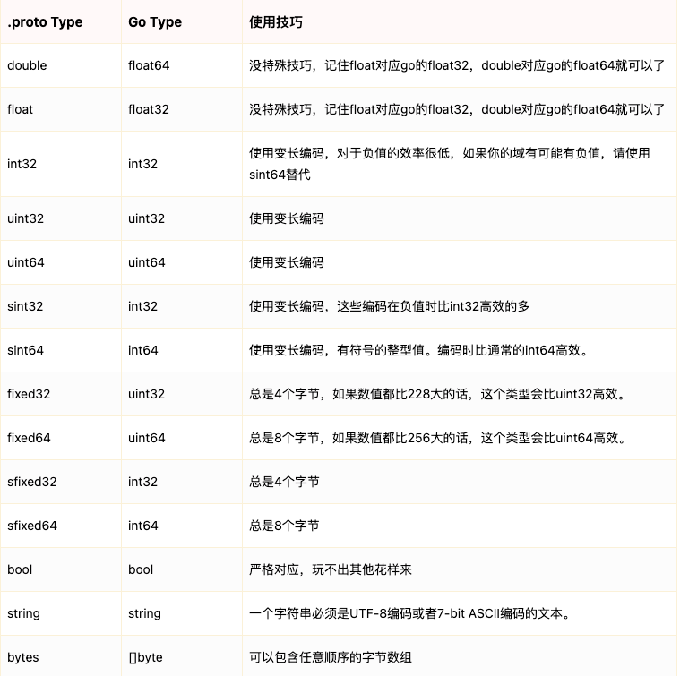

# go-protobuf
golang + ProtoBuf 案例演示


## 使用步骤

#### ProtoBuf 安装

安装主流的 proto3

```bash
brew install ProtoBuf
```

官网安装： https://github.com/protocolbuffers/ProtoBuf/releases

#### protoc-gen-go 安装

将 proto 转换为 go 文件

```bash
go get github.com/golang/protobuf/protoc-gen-go
```


#### 写 proto 文件

```bash
mkdir proto/demo
cd proto/demo
```

文件： `hello.proto`

```proto
syntax = "proto3";

package hello;

option go_package = "./;hello";

message Say{
  int64           id    = 1;
  string          hello = 2;
  repeated string word  = 3;
}
```

#### 自动生成 go 代码

```bash
protoc --go_out=. hello.proto
```


解释说明：

```bash
protoc [OPTION] PROTO_FILES

OPTION 是命令的选项，PROTO_FILES是我们要编译的proto消息定义文件，支持多个。
```

常用的 OPTION 选项：

```bash
  --go_out=OUT_DIR            指定代码生成目录，生成 Go 代码
  --cpp_out=OUT_DIR           指定代码生成目录，生成 C++ 代码
  --csharp_out=OUT_DIR        指定代码生成目录，生成 C# 代码
  --java_out=OUT_DIR          指定代码生成目录，生成 java 代码
  --js_out=OUT_DIR            指定代码生成目录，生成 javascript 代码
  --objc_out=OUT_DIR          指定代码生成目录，生成 Objective C 代码
  --php_out=OUT_DIR           指定代码生成目录，生成 php 代码
  --python_out=OUT_DIR        指定代码生成目录，生成 python 代码
  --ruby_out=OUT_DIR          指定代码生成目录，生成 ruby 代码
```


## 多种类型

### 枚举类型

也就是预定义值

```proto
syntax = "proto3";//指定版本信息，非注释的第一行

enum SexType //枚举消息类型，使用enum关键词定义,一个性别类型的枚举类型
{
    UNKONW = 0; //proto3版本中，首成员必须为0，成员不应有相同的值
    MALE = 1;  //1男
    FEMALE = 2; //2女  0未知
}

// 定义一个用户消息
message UserInfo
{
    string name = 1; // 姓名字段
    SexType sex = 2; // 性别字段，使用SexType枚举类型
}
```

### 消息嵌套

结构体复用是很常见的场景，下面是两种写法：

引用

```proto
// 定义Article消息
message Article {
  string url = 1;
  string title = 2;
  repeated string tags = 3; // 字符串数组类型
}

// 定义ListArticle消息
message ListArticle {
  // 引用上面定义的Article消息类型，作为results字段的类型
  repeated Article articles = 1; // repeated关键词标记，说明articles字段是一个数组
}
```

嵌套

```proto
message ListArticle {
  // 嵌套消息定义
  message Article {
    string url = 1;
    string title = 2;
    repeated string tags = 3;
  }
  // 引用嵌套的消息定义
  repeated Article articles = 1;
}
```

import 导入其他 proto 文件，分文件方便管理

例子：

创建文件: `article.proto`

```proto
syntax = "proto3";

package nesting;

option go_package = "./;article";

message Article {
  string          url   = 1;
  string          title = 2;
  repeated string tags  = 3; // 字符串数组类型
}
```

创建文件: `list_article.proto`

```proto
syntax = "proto3";
// 导入Article消息定义
import "article.proto";

package nesting;

option go_package = "./;article";

// 定义ListArticle消息
message ListArticle {
  // 使用导入的Result消息
  repeated Article articles = 1;
}
```

### map 语法

语法格式：

```bash
map<key_type, value_type> map_field = N;
```

以下四点非常重要：

1. key_type可以是任何整数或字符串类型（除浮点类型和字节之外的任何标量类型）。
2. **注意：枚举不是有效的key_type。**
3. value_type 可以是除另一个映射之外的任何类型。
4. Map 字段不能使用repeated关键字修饰。

例子：学生的学科-分数使用 map 定义：

```proto
syntax = "proto3";

package map;

option go_package = "./;score";

message Student{
  int64              id    = 1; //id
  string             name  = 2; //学生姓名
  map<string, int32> score = 3;  //学科 分数的map
}
```


## 附录

### 字段类型表




参考鸣谢： [juejin](https://juejin.cn/post/7144948875613339685)
