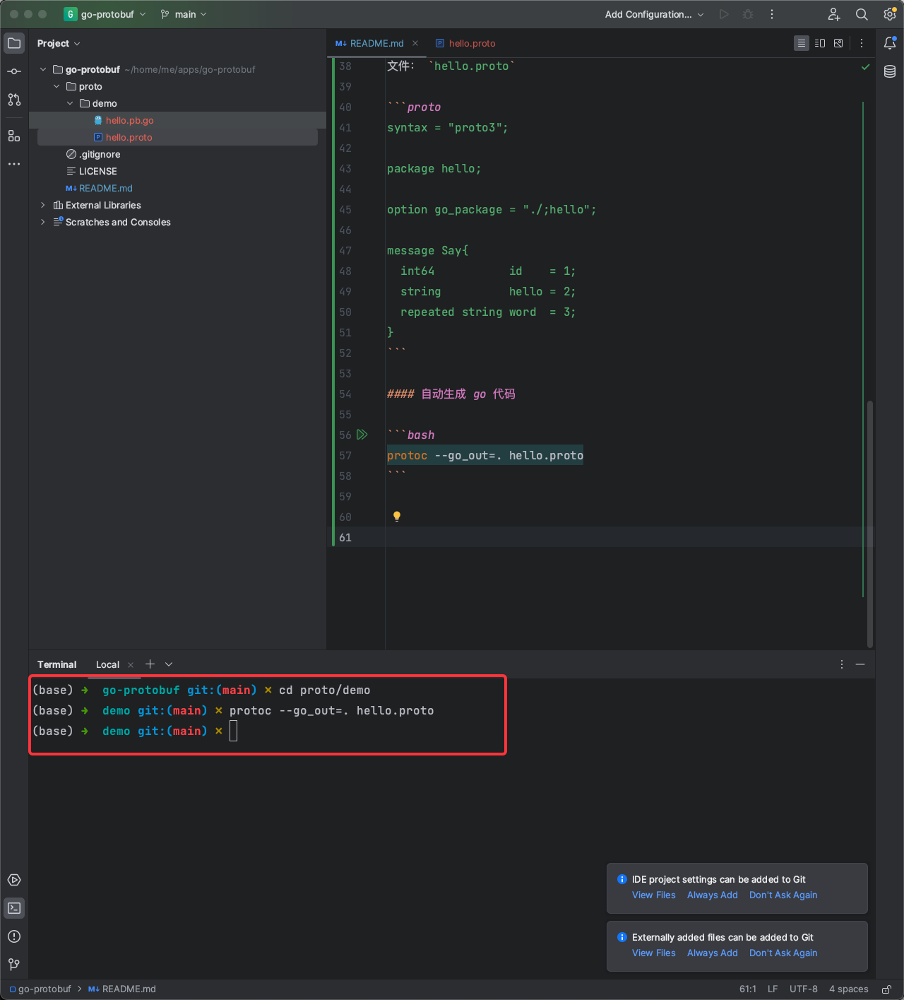

# go-protobuf
golang + ProtoBuf 案例演示


## 使用步骤

#### ProtoBuf 安装

安装主流的 proto3

```bash
brew install ProtoBuf
```

官网安装： https://github.com/protocolbuffers/ProtoBuf/releases

#### protoc-gen-go 安装

将 proto 转换为 go 文件

```bash
go get github.com/golang/protobuf/protoc-gen-go
```


#### 写 proto 文件

```bash
mkdir proto/demo
cd proto/demo
```

文件： `hello.proto`

```proto
syntax = "proto3";

package hello;

option go_package = "./;hello";

message Say{
  int64           id    = 1;
  string          hello = 2;
  repeated string word  = 3;
}
```

#### 自动生成 go 代码

```bash
protoc --go_out=. hello.proto
```



